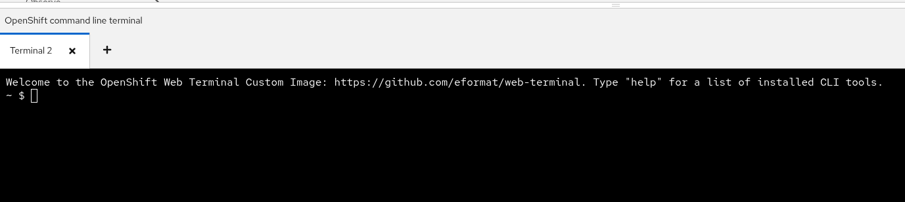
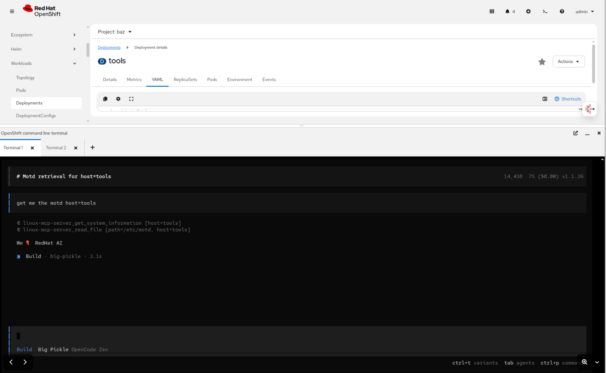

# RHEL Lightspeed demo with Opencode

Demo [rhel lightspeed](https://github.com/rhel-lightspeed/linux-mcp-server) using OpenShift + Opencode.

## Opencode CLI agent using web-terminal

1. Install web-terminal in your cluster. Login using oc as cluster-admin then run:

    ```bash
    curl -Ls https://raw.githubusercontent.com/eformat/web-terminal/refs/heads/main/web-terminal-all-in-one.sh | bash -s
    ```

2. Select `>_ OpenShift command line` in top right of OpenShift UI.

3. Initialze default terminal by hitting `Start`.

    

4. Wait for the custom image to download and start a pod in the `openshift-terminal` namespace. You should see the following prompt:

    

5. Install [`Opencode`](https://github.com/sst/opencode)

    ```bash
    npm i opencode-ai@latest
    ```

6. Put opencode on path (not persistent).

    ```bash
    echo 'export PATH=$HOME/node_modules/.bin:$PATH' >> ~/.bashrc
    bash
    ```

8. Run `opencode` using the default model.

    ```bash
    opencode
    ```

    

## Build and deploy a test ssh server pod

1. We are using a `ubi10/ubi-init` container with sshd installed. Built using:

    ```bash
    podman build -t quay.io/eformat/app-systemd-demo:latest -f Containerfile
    ```

    ```bash
    podman push quay.io/eformat/app-systemd-demo:latest
    ```

2. Deploy ubi container.

    ```bash
    oc apply -f ubi-rhel-server.yaml
    ```

3. Setup ssh in container (manual for now).

    ```bash
    oc rsh $(oc get pod -l deployment=tools -o name)
    ```

    ```bash
    ssh-keygen
    ```

    ```bash
    cat ~/.ssh/id_ed25519.pub > ~/.ssh/authorized_keys
    ```

4. Take note of private key.

    ```bash
    cat ~/.ssh/id_ed25519
    ```

## Setup web terminal for ssh connection to test server pod

1. Back in the web terminal. Update the `HostName` to match your namespace/service for tools pod.

    ```bash
    cat > ~/.ssh/config  << EOF
    host tools
            HostName tools.baz.svc.cluster.local
            Port 2222
            IdentityFile ~/.ssh/id_tools
            User root
            Compression yes
            ForwardX11 no
            Protocol 2
            GSSAPIAuthentication no
            GatewayPorts yes
            IdentitiesOnly yes
    EOF
    chmod 600 ~/.ssh/config
    ```

2. Update local ssh keys using the private key from `tools` pod above.

    ```bash
    ssh-keygen
    ```

    ```bash
    vi .ssh/id_tools # use the key from test server - cat .ssh/id_ed25519 from ssh pod
    ```

    ```bash
    chmod 600 ~/.ssh/id_tools
    ```

3. Test password-less ssh works, add key to know-hosts.

    ```bash
    ssh tools
    ```

    if OK - you should see something like:

    ```bash
    We ❤️ RedHat AI
    Last login: Tue Jan 20 07:32:09 2026 from 10.128.0.141
    [root@tools-6d6db694c5-924mj ~]#
    ```

## Configure Opencode for RHEL MCP

1. Install [rhel lightspeed](https://github.com/rhel-lightspeed/linux-mcp-server) in your web-terminal

     ```bash
     pip install linux-mcp-server
     ```

2. Add MCP Server configuration to opencode. Edit:

    ```bash
    vi ~/.config/opencode/opencode.json
    ```

    ```json
    {
    "$schema": "https://opencode.ai/config.json",
        "mcp": {
            "linux-mcp-server": {
                "type": "local",
                "command": [
                    "~/.local/bin/linux-mcp-server"
                ],
                "enabled": true,
                "environment": {
                    "LINUX_MCP_USER": "root"
                }   
            }
        }
    }
    ```

3. Restart opencode.

## Test it out

Query opencode for host details e.g.

```bash
get me the motd for host=tools
```

See [Usage docs](https://rhel-lightspeed.github.io/linux-mcp-server/usage/) for more details.


