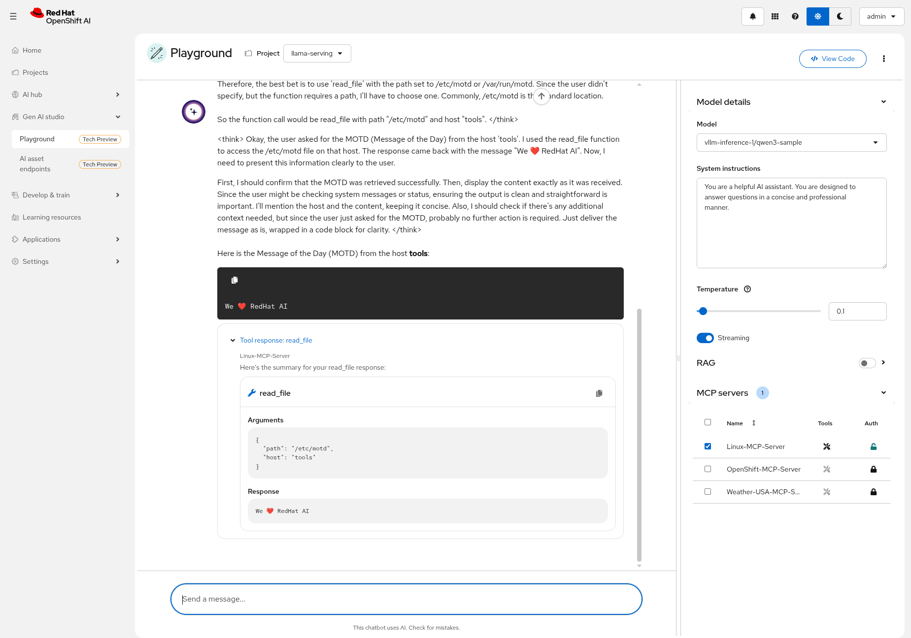

# RHEL Lightspeed demo with RHOAI Playground

Demo [rhel lightspeed](https://github.com/rhel-lightspeed/linux-mcp-server) using OpenShift + RHOAI Playground.

## Build and deploy a test ssh server pod

1. We are using a `ubi10/ubi-init` container with sshd installed. Built using:

    ```bash
    podman build -t quay.io/eformat/app-systemd-demo:latest -f Containerfile
    ```

    ```bash
    podman push quay.io/eformat/app-systemd-demo:latest
    ```

2. Deploy ubi container.

    ```bash
    oc apply -f ubi-rhel-server.yaml
    ```

3. Setup ssh in container (manual for now).

    ```bash
    oc rsh $(oc get pod -l deployment=tools -o name)
    ```

    ```bash
    ssh-keygen
    ```

    ```bash
    cat ~/.ssh/id_ed25519.pub > ~/.ssh/authorized_keys
    ```

4. Take note of private key.

    ```bash
    cat ~/.ssh/id_ed25519
    ```

## Run RHEL Lightspeed in a container

We are going to run this manually for now.

1. Deploy a web-terminal container manually.

    ```bash
    oc new-app --name=linux-mcp-server quay.io/eformat/web-terminal:latest -l kueue.x-k8s.io/queue-name=default
    ```

2. Create a Service for our pod that will point to RHEL Lightspeed.

    ```bash
    oc expose deployment linux-mcp-server --port=8000
    ```

3. Install `linux-mcp-server` using pip in the container.

    ```bash
    oc rsh $(oc get pod -l deployment=linux-mcp-server -o name)
    ```

    ```bash
    pip install linux-mcp-server
    ```

4. Update local ssh keys using the private key from `tools` pod above.

    ```bash
    ssh-keygen
    ```

    ```bash
    vi .ssh/id_tools # use the key from test server - cat .ssh/id_ed25519 from ssh pod
    ```

    ```bash    chmod 600 ~/.ssh/id_tools
    ```

5. Update the `HostName` to match your namespace/service for tools pod.

    ```bash
    cat > ~/.ssh/config  << EOF
    host tools
            HostName tools.baz.svc.cluster.local
            Port 2222
            IdentityFile ~/.ssh/id_tools
            User root
            Compression yes
            ForwardX11 no
            Protocol 2
            GSSAPIAuthentication no
            GatewayPorts yes
            IdentitiesOnly yes
    EOF
    chmod 600 ~/.ssh/config
    ```

6. Test password-less ssh works, add key to know-hosts.

    ```bash
    ssh tools
    ```

    if OK - you should see something like:

    ```bash
    We ❤️ RedHat AI
    Last login: Tue Jan 20 07:32:09 2026 from 10.128.0.141
    [root@tools-6d6db694c5-924mj ~]#

7. Hack - fix the mcp server so it talks over Streamable HTTP rather than using the default STDIO.

    ```bash
    vi ./.local/lib/python3.12/site-packages/linux_mcp_server/server.py
    ```

    Replace the file with [server.py](server.py)

8. Run `linux-mcp-server`

    ```bash
    linux-mcp-server
    ```

9. From your laptop command line that is logged into RHOAI - create the MCP entry for the Playground.

    ```bash
    cat <<EOF | oc apply -f -
    ---
    kind: ConfigMap
    apiVersion: v1
    metadata:
      name: gen-ai-aa-mcp-servers
      namespace: redhat-ods-applications
    data:
        Linux-MCP-Server: |
        {
          "url": "http://linux-mcp-server.llama-serving.svc.cluster.local:8000/mcp",
          "transport": "streamableHttp",
          "description": "Linux MCP Server"
        }
    EOF
    ```

10. Deploy an LLM with tool calling enabled to use as a GenAI Asset from the Playground. Note the hardware profile and Kueue labels and annotations may need adjusting.

    ```bash
    oc apply -f qwen3-no-auth-llmisvc.yaml
    ```

11. From the RHOAI **GenAI Studio** > **Models** - select **Add to playground**. Go into the LlamaStack playground UI.

12. Select and authorize the **Linux-MCP-Server**

## Test it out

Query for host details e.g.

```bash
get me the motd for host=tools
```

See [Usage docs](https://rhel-lightspeed.github.io/linux-mcp-server/usage/) for more details.


